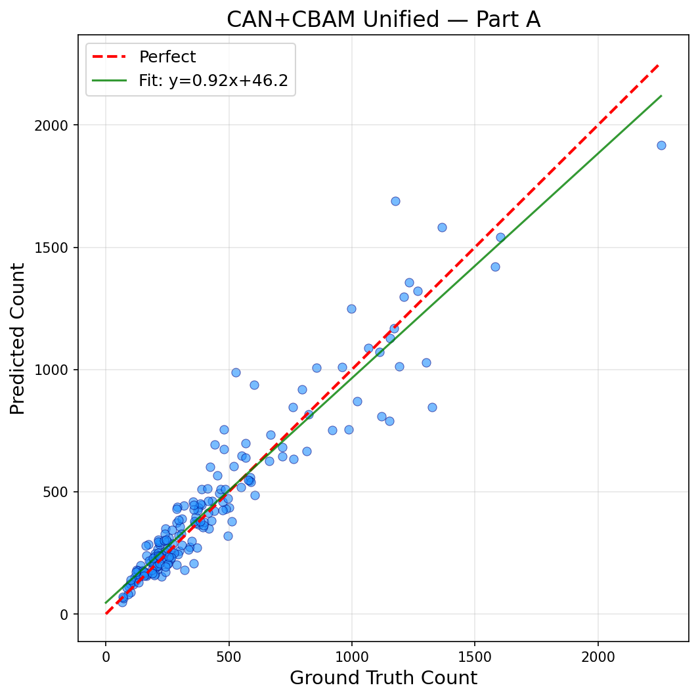
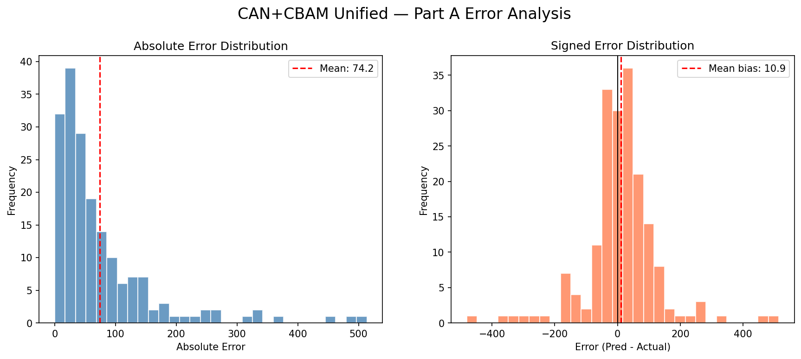
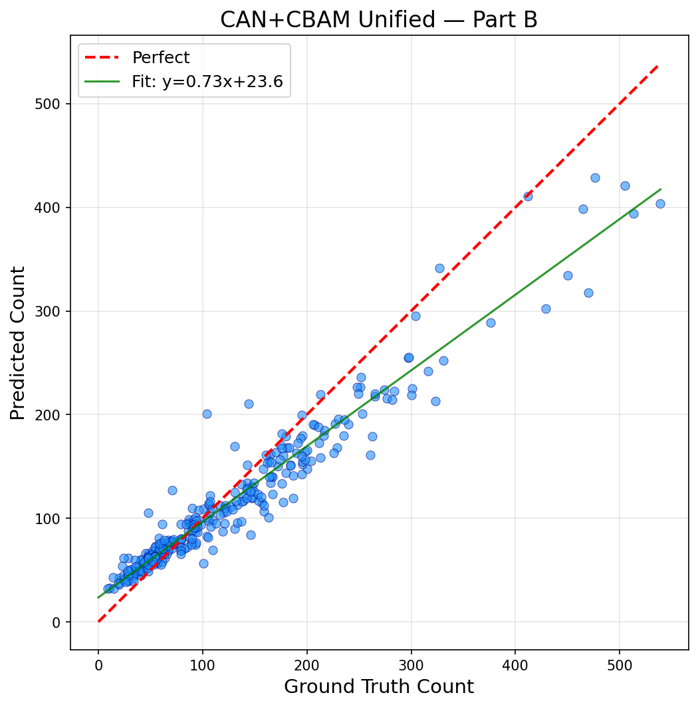
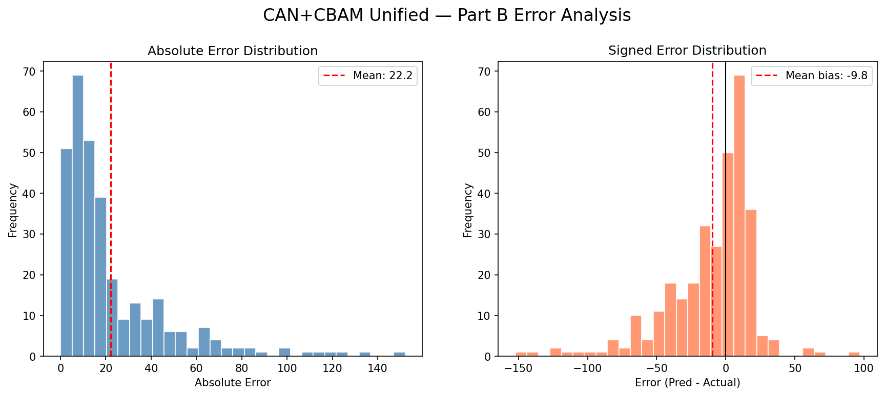

# CAN + CBAM Unified Crowd Density Estimator

This project implements a state-of-the-art Context-Aware Network (CAN) integrated with Convolutional Block Attention Module (CBAM) for highly accurate and robust crowd density estimation.

## Architecture

1. **VGG-16 Frontend**: Acts as the general feature extractor to identify shapes, textures, and patterns common to human heads.
2. **Scale-Aware Module (SAM)**: Uses parallel dilated convolutions to capture multi-scale features (for people at different distances/sizes in the crowd) simultaneously.
3. **CBAM Attention**: Learns which feature maps carry the most information for counting, and focuses on spatial areas containing people while suppressing background noise.
4. **DeepLabV3 Segmentation**: Preprocesses input images to remove background elements (e.g., trees, buildings), preventing false positives.

## Methodology

### Ground Truth Generation
We transform discrete head point coordinates into continuous density maps using Gaussian kernels.
- **Adaptive σ**: Used for dense crowds, preventing "density bleeding" between overlapping heads.
- **Fixed σ**: Used for sparse scenes where local density varies too much.
The integral property of the density map ensures that the sum of all pixel values corresponds to the total number of people in the image.

### Training Pipeline
- **Skip Connections**: Used in the SAM module to prevent vanishing gradients and provide a clean path for backpropagation.
- **Auxiliary Classifier**: Predicts "Dense" vs "Sparse" scenes, acting as a secondary objective that forces the VGG frontend to understand the overall context of the crowd.

### Inference Pipeline
1. **Segment**: DeepLabV3 masks the background.
2. **Extract**: VGG-16 extracts low-level features.
3. **Scale**: SAM extracts multi-scale features.
4. **Attend**: CBAM filters and refines features.
5. **Predict**: The backend decoder generates a 1-channel density map.
6. **Count**: The density map is summed to produce the final crowd count.

## Usage

1. Place input images in the intended directory.
2. Ensure pre-trained weights are located in the `checkpoints` folder.
3. Run `app.py` to start the web application for real-time visualization and crowd counting inference.

## Results and Metrics

Our unified model has been evaluated on the ShanghaiTech dataset (Part A and Part B). The performance metrics based on our testing are summarized below:

| Metric | ShanghaiTech Part A | ShanghaiTech Part B |
|--------|---------------------|---------------------|
| **MAE**    | 74.20               | 22.24               |
| **MSE**    | 13074.58            | 1074.49             |
| **RMSE**   | 114.34              | 32.78               |
| **MAPE**   | 18.46%              | 23.04%              |
| **R²**     | 0.895               | 0.881               |
| **SSIM**   | 0.599               | 0.483               |
| **PSNR**   | 22.16               | 25.09               |

Visualizations and per-image evaluations can be found in the `results` folder.

### ShanghaiTech Part A

  
  

### ShanghaiTech Part B

  
  

